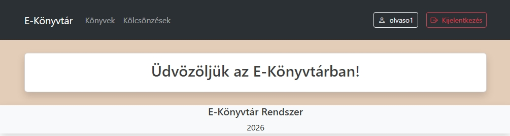
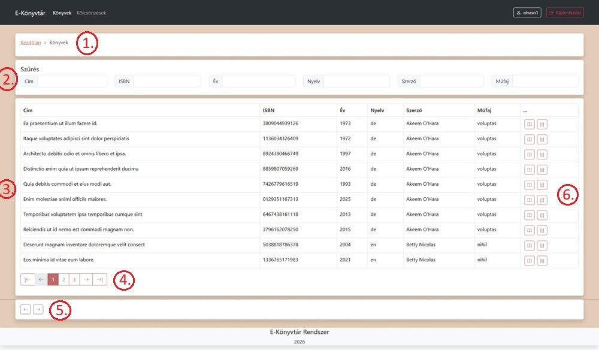
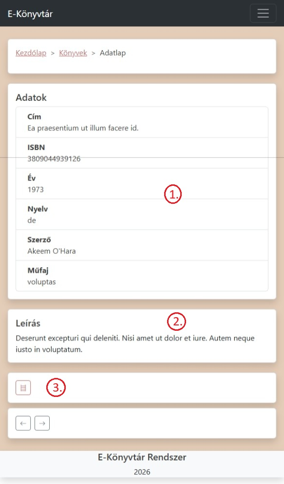
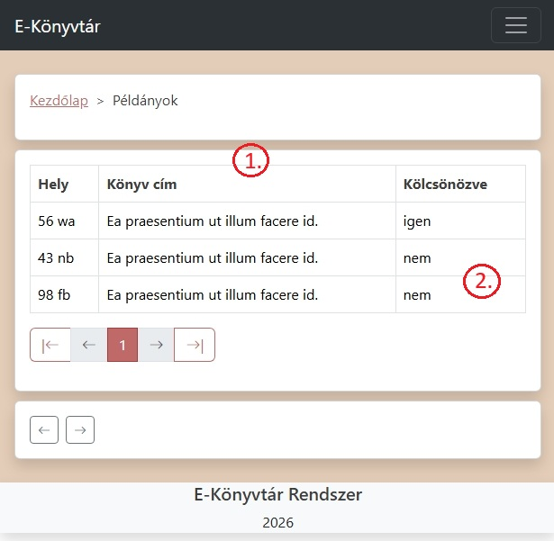
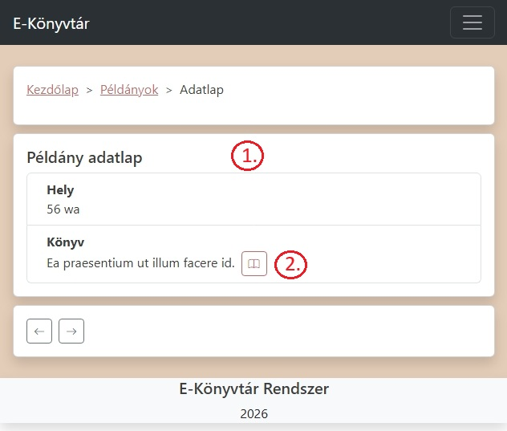
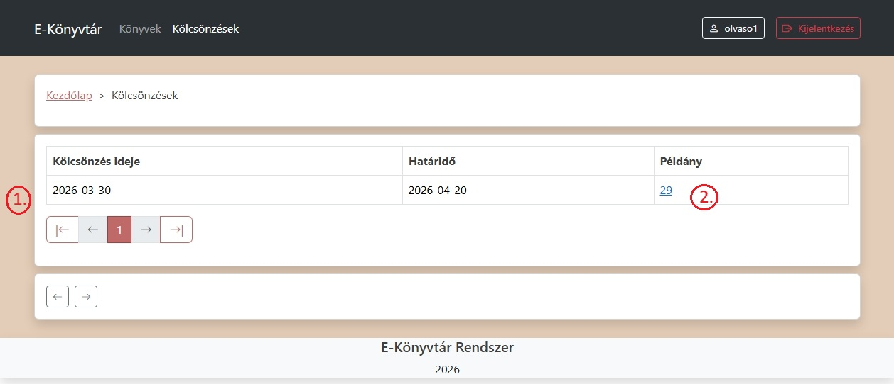
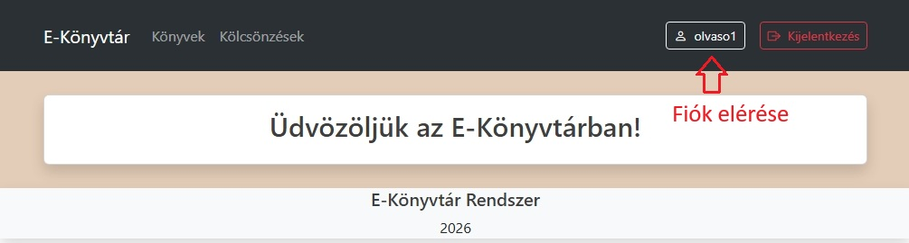
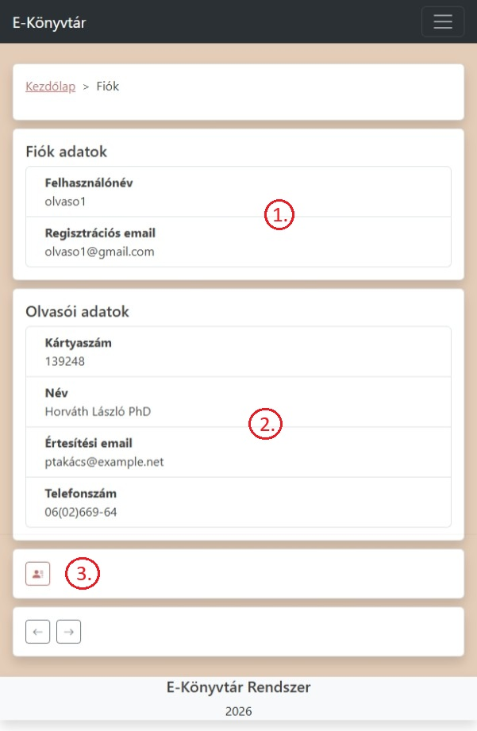

# Felhasználói Útmutató (Olvasói felület)

Az E-Könyvtár alkalmazás használatának bemutatása

## Könyvek

1. Breadcrumb navigációs menü (a kezdőlap kivételével minden oldalon megtalálható)

2. Keresés - gépelésnél autómatikusan frissíti a listát a találatok szerint

3. A találatok adatainak táblázatos megjelenítése

4. Váltás a találati oldalak között, oldalanként tíz találat kerül megjelenítésre

5. Navigációs gombok (vissza, előre), funkcionalitásban a böngészö hasonló gombjaival egyeznek meg, kivéve ha nincs elözmény a könyvtár alkalmazásban, ilyenkor a "vissza" gombra kattintva a kezdőlapra visz

6. Műveletek az adott könyvvel:
    - adatlap 
    - pédányok 

---
### Adatlap

1. A kiválasztott könyv adatai

2. Leírása

3. A könyvhöz tartozó példányok

---
## Példányok

1. Példányok listája, adatai

2. Elérhetőség

### Adatlap

1. Példány adatai

2. Példányhoz tartozó könyv adatlapjának megnyitása

(A példány adatlapja csak a hozzá tartozó kölcsönzésnél lévő linken keresztűl elérhető.)

---
## Kölcsönzések

1. Saját kölcsönzések

2. A példány oszlopban lévő linkre kattintva elérhető az adott kölcsönzéshez tartozó példány adatlapja.

---
## Fiók

1. Felhasználói adatok

2. Olvasói adatok

3. A fiókból is elérhetők a saját kölcsönzések