# Felhasználói Útmutató (Admin/Könyvtáros felület)

Az E-Könyvtár alkalmazás használatának bemutatása

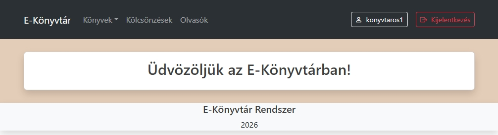

## Könyvek

### Listázás

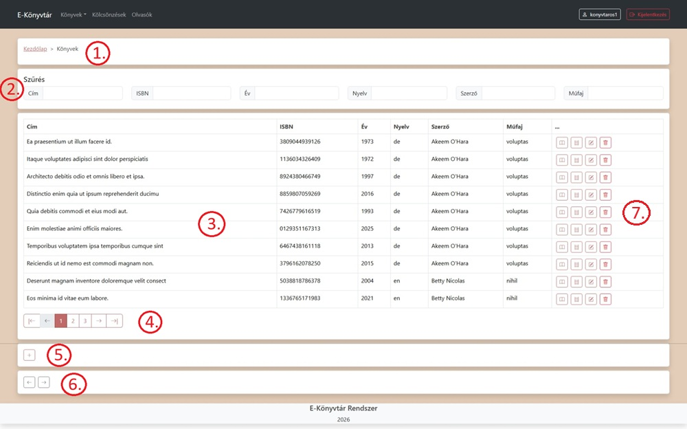

1. Breadcrumb navigációs menü (a kezdőlap kivételével minden oldalon megtalálható)

2. Keresés - gépelésnél autómatikusan frissíti a listát a találatok szerint

3. A találatok adatainak táblázatos megjelenítése

4. Váltás a találati oldalak között, oldalanként tíz találat kerül megjelenítésre

5. Új könyv adatainak felvétele

6. Navigációs gombok (vissza, előre), funkcionalitásban a böngészö hasonló gombjaival egyeznek meg, kivéve ha nincs elözmény a könyvtár alkalmazásban, ilyenkor a "vissza" gombra kattintva a kezdőlapra visz

7. Műveletek az adott könyvvel:
    - adatlap 
    - pédányok 
    - szerkesztés 
    - törlés

---
### Adatlap

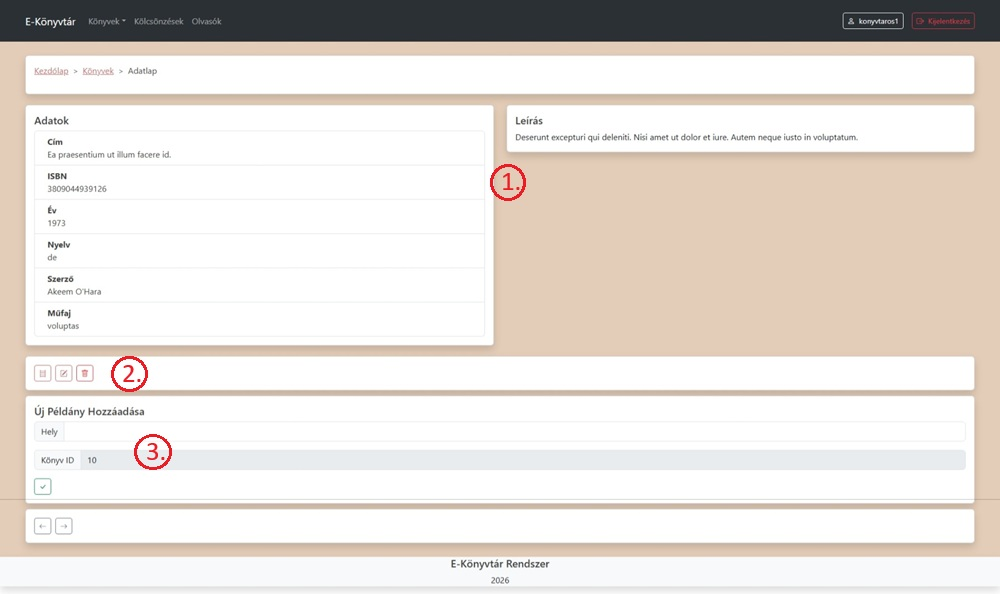

1. A kiválasztott könyv adatai és leírása

2. Műveletek: 
    - az adott könyvhöz tartozó példányok megjelenítése 
    - szerkesztés
    - törlés

3. Új, az adott könyvhöz tartozó példány adatainak felvétele

---
### Új könyv felvétele/meglévő szerkesztése

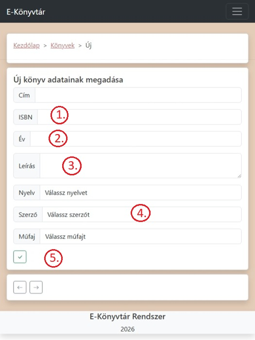  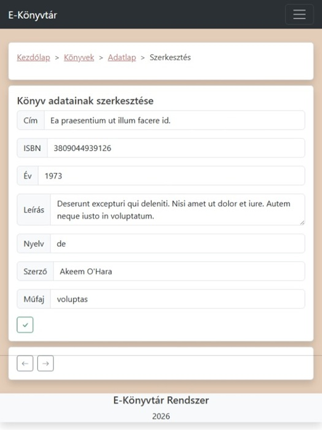

1. Csak a 13 számjegyű verzíó elfogadott

2. A kiadás éve

3. A könyv rövid leírása, pl.: formátum, tartalom

4. Lenyíló listák nyelv, szerző, műfaj választásához

5. Mentés

Hibás adatok esetén a felület visszajelzést kűld a hiba okáról:

- kliens oldalról:

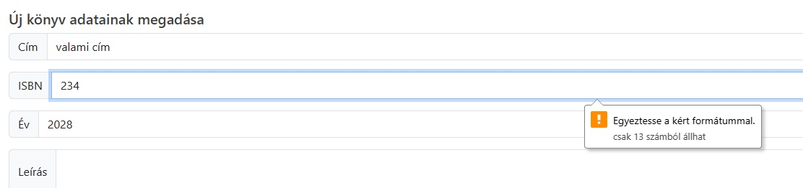

- szerver oldalról (ha a kliens oldali ellenőrzés nem szri ki a hibát):

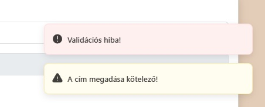

Sikeres mentés esetén az alábbi üzenet jelenik meg:

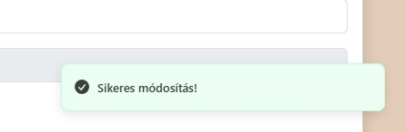

Hasonló visszajelzéseket kapunk más adatok(pl.: példányok, olvasók) megadásakor/szerkesztésekor is.

---
### Törlés

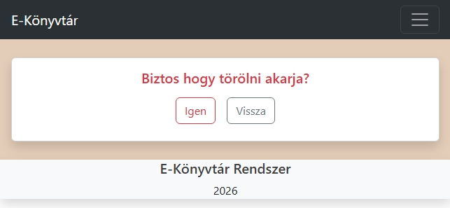

A kiválasztott könyv törlése.

Hasonló párbeszéd felület jelenik meg más adatok(pl.: példányok, olvasók) törlésekor is.

---
## Nyelvek, szerzők, műfajok

### Listázás

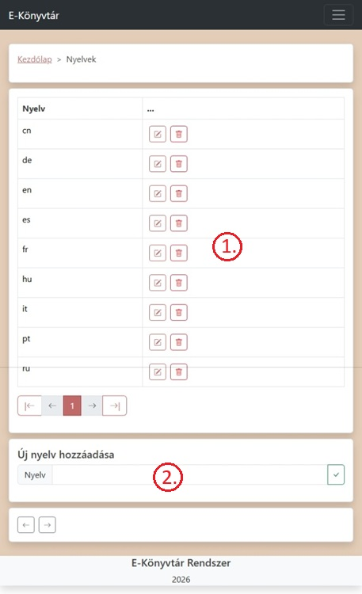

1. Szerkesztés, törlés

2. Új nyelv/szerző/műfaj hozzáadása

---
### Szerkesztés

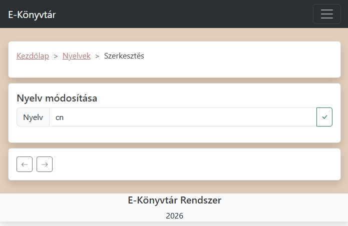

---
## Példányok

A könyv listában, vagy az adatlapon a "példányok" gombra kattintva az alábbi felület jelenik meg:

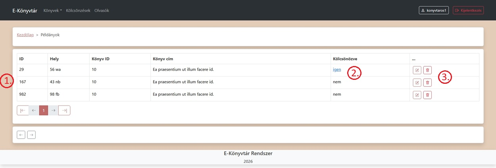

1. Csak a kiválasztott könyvhöz tartozó példányok jelennek meg a táblázatban

2. Ha az adott példány ki van kölcsönözve, a megjelenő linkre kattintva elérhetőek a hozzá tartozó kölcsönzés adatai

3. Példány szerkesztésére, törlésére szolgáló gombok

---
### Adatlap

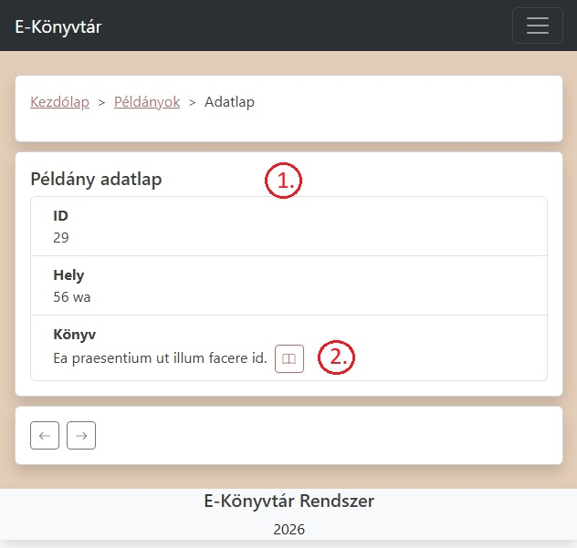

1. Példány adatok

2. Példányhoz tartozó könyv adatlapjának megnyitása

---
### Új példány felvétele/meglévő szerkesztése

Új példány felvétele a korábban leírtak szerint az adott könyv adatlapján lehetséges.

Szerkesztésre az alábbi felület szolgál:

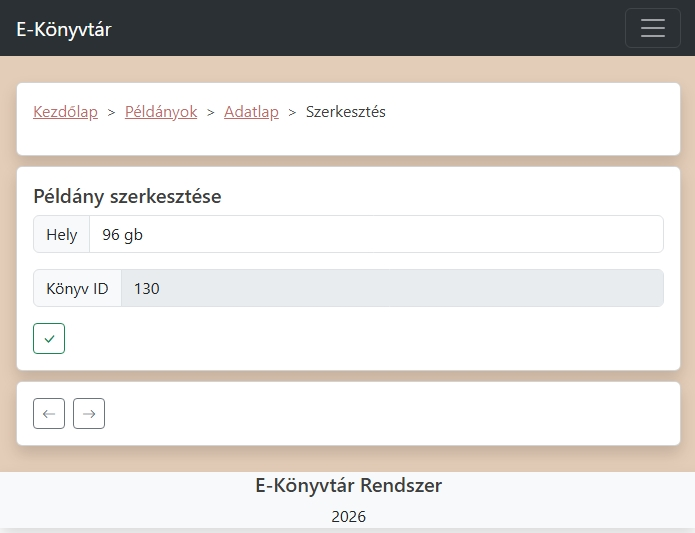

A könyv id előre megadásra kerűl, nem szerkeszthető!

---
## Olvasók

### Listázás

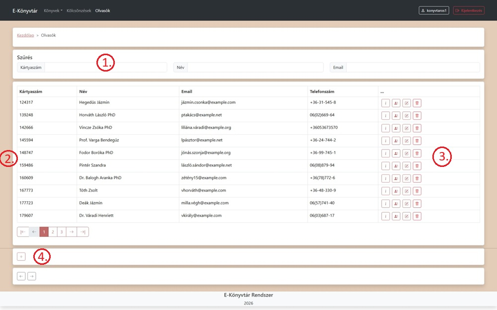

1. Keresés, könyveknél látotthoz hasonlóan működik, a lista autómatikus frissítésével

2. Kilistázott olvasók adatainak táblázatos megjelenítése

3. Műveletek:

    - adatlap
    - az adott olvasó kölcsönzései
    - szerkesztés
    - törlés

4. Új olvasó felvétele

---
### Adatlap

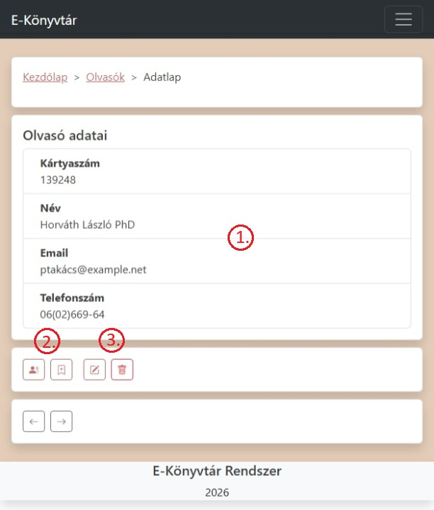

1. olvasói adatok

2. kölcsönzések

    - meglévők listázása
    - új kölcsönzés felvétele

3. Szerkesztés, törlés

---
### Új olvasó felvétele/meglévő szerkesztése

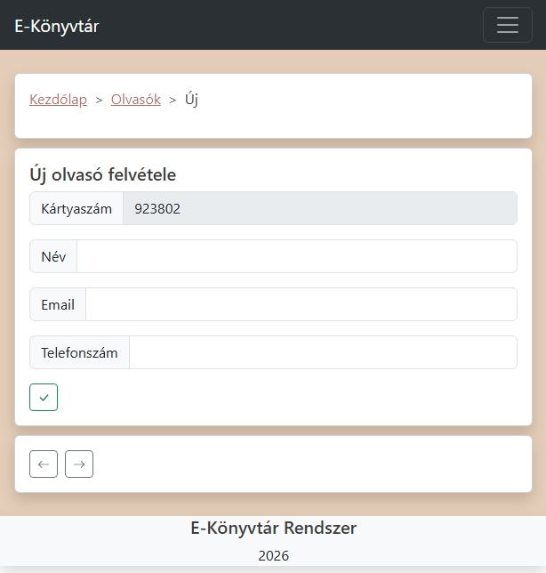 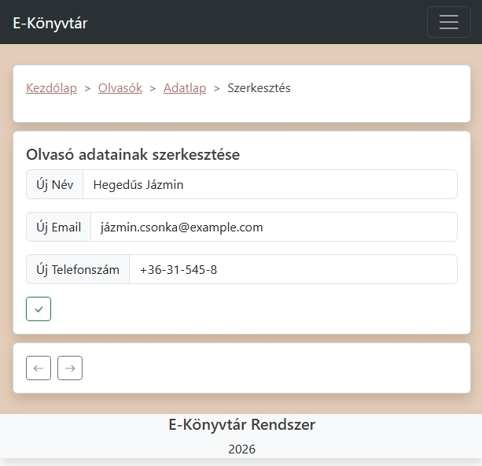

Új olvasó felvételekor a kártyaszám egy autómatikusan generált szám lesz(100000 - 999999 között), nem módosítható. Számegyezés nem lehetséges, ez mind kliens mind szerver oldalon ellenőrzésre kerül.  
Szerkesztéskor szintén nincs lehetőség a kártyaszám módosítására.

---
## Kölcsönzések

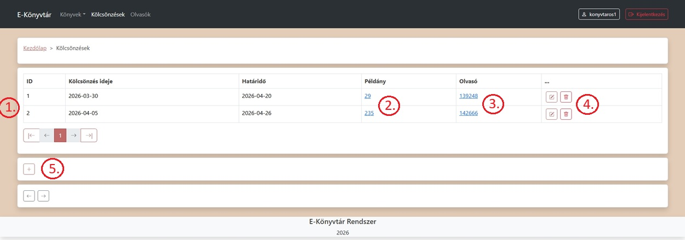

1. Listázás

2. Kölcsönzött példány adatlapja

3. Kölcsönző olvasó adatlapja

4. Szerkesztés, törlés

5. Új kölcsönzés felvétele

A lejárt határidejű kölcsönzéseknél az alábbi figyelmeztetés jelenik meg:

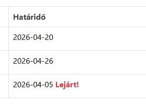

---
### Új kölcsönzés felvétele

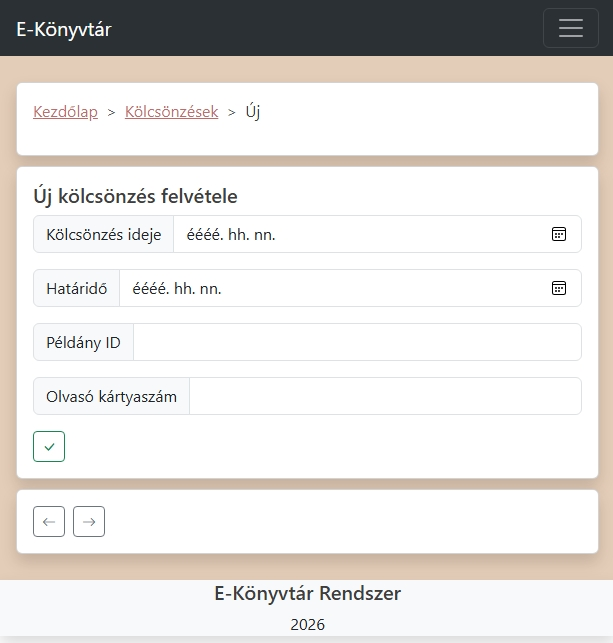 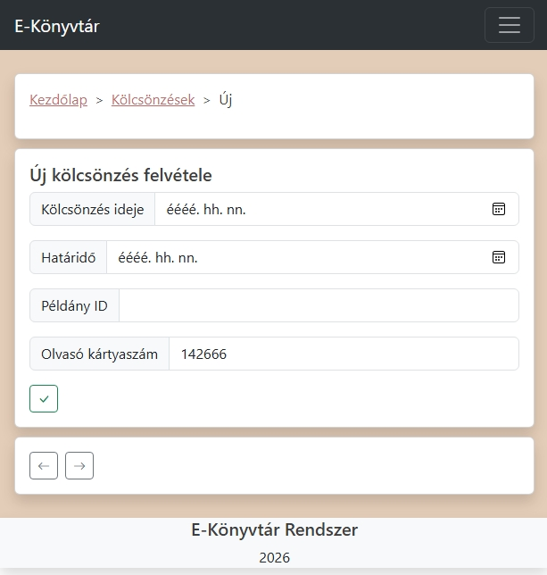

Ha egy olvasó adatlapjáról navigálunk az új kölcsönzés felvételéhez, a kártyaszám autómatikusan kiegészítésre kerül.

Ha a kezdő dátumot nem adjuk meg, az aznapi dátum kerül mentésre.

Csak meglévő példány id-t, illetve kártyaszámot lehet megadni!

---
### Kölcsönzés módosítása

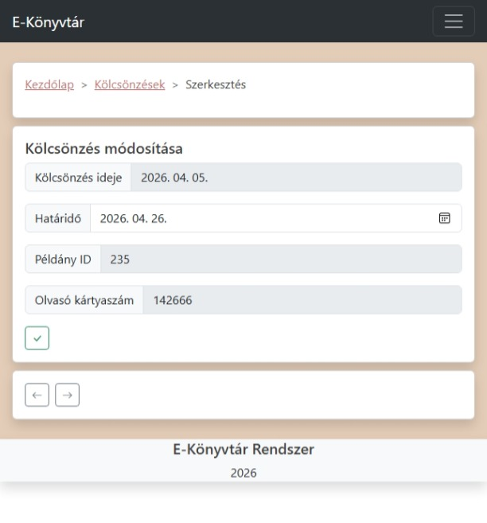

Csak a határidő módosítható(hosszabbítás)!

---
## Felhasználói fiók

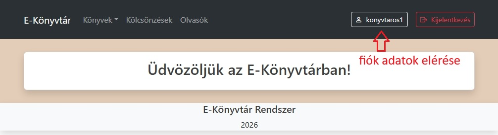

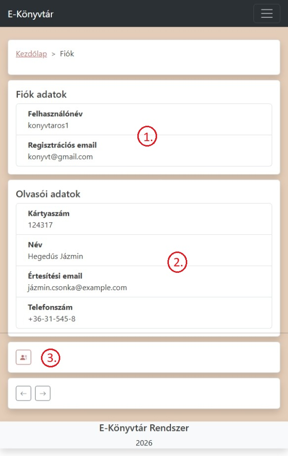

1. Felhasználói adatok, a könyvtáros maga is felhasználó, admin jogosultsággal.

2. Mivel a könyvtárosnak is lehetősége van kölcsönzésre, így olvasói adatok is tartoznak hozzá.

3. Saját kölcsönzések megtekintése.

